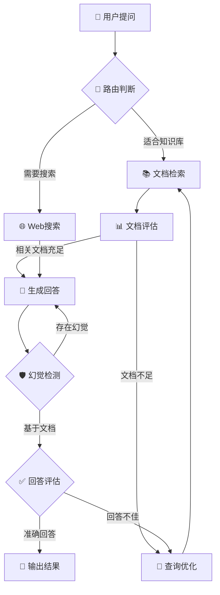

<div align="center">

# 🔍 RAG 企业知识库系统

[](https://www.python.org/)
[](https://www.langchain.com/)
[](https://milvus.io/)
[](https://langchain-ai.github.io/langgraph/)
[](LICENSE)

**基于 LangChain + Milvus + LangGraph 构建的智能 RAG 企业知识库系统**

[🚀 快速开始](#-快速开始) · [📖 文档](#-核心功能) · [🔧 配置](#-配置说明) · [💡 示例](#-使用示例)

</div>

---

## 📋 目录

- [项目简介](#-项目简介)
- [核心功能](#-核心功能)
- [技术架构](#-技术架构)
- [快速开始](#-快速开始)
- [项目结构](#-项目结构)
- [工作流程](#-工作流程)
- [使用示例](#-使用示例)
- [配置说明](#-配置说明)
- [API 参考](#-api-参考)

---

## 🎯 项目简介

本项目是一个完整的 **RAG（检索增强生成）** 企业知识库解决方案，支持文档解析、向量化存储、混合检索和智能问答。

<table>
<tr>
<td width="50%">

### ✨ 核心特性

- 🔀 **混合检索** - Dense + BM25 双路召回
- 🧭 **智能路由** - 自动选择知识库/网络搜索
- 📊 **文档评估** - 相关性评分过滤
- 🔄 **查询优化** - 自动改写检索词
- 🛡️ **幻觉检测** - 确保回答可靠性
- 💬 **多轮对话** - 支持上下文记忆

</td>
<td width="50%">

### 🛠️ 技术栈

| 分类 | 技术 |
|:---:|:---:|
| 🧩 编排框架 | LangChain / LangGraph |
| 🗄️ 向量数据库 | Milvus |
| 🤖 LLM | OpenAI / DeepSeek |
| 📝 Embedding | BGE-small-zh |
| 🌐 Web搜索 | Tavily |
| 📋 日志 | Loguru |

</td>
</tr>
</table>

---

## ⚡ 核心功能

<table>
<tr>
<th width="33%">🔀 混合检索</th>
<th width="33%">🧭 智能路由</th>
<th width="33%">🛡️ 幻觉检测</th>
</tr>
<tr>
<td>

结合密集向量检索（Dense）和稀疏向量检索（BM25），使用 RRF 算法融合排序，大幅提升检索准确率。

</td>
<td>

自动判断问题是否适合知识库检索，不适合则转向 Tavily 网络搜索，确保问题得到解答。

</td>
<td>

检测生成内容是否基于参考文档，过滤幻觉内容，保证回答的真实性和可靠性。

</td>
</tr>
</table>

---

## 🏗️ 技术架构

```
┌─────────────────────────────────────────────────────────────────┐
│                         用户输入问题                              │
└─────────────────────────────┬───────────────────────────────────┘
                              │
                              ▼
                    ┌─────────────────┐
                    │   🧭 问题路由    │
                    └────────┬────────┘
                             │
              ┌──────────────┼──────────────┐
              ▼              │              ▼
      ┌───────────────┐      │      ┌───────────────┐
      │ 🌐 Web 搜索    │      │      │ 📚 知识库检索  │
      │   (Tavily)    │      │      │    (Milvus)   │
      └───────┬───────┘      │      └───────┬───────┘
              │              │              │
              │              │              ▼
              │              │      ┌───────────────┐
              │              │      │ 📊 文档评估    │
              │              │      └───────┬───────┘
              │              │              │
              │              │       ┌──────┴──────┐
              │              │       ▼             ▼
              │              │ ┌───────────┐ ┌───────────┐
              │              │ │ 🔄 查询优化 │ │ ⚡ 直接生成 │
              │              │ └─────┬─────┘ └─────┬─────┘
              │              │       │             │
              └──────────────┼───────┴─────────────┘
                             │
                             ▼
                    ┌─────────────────┐
                    │   🤖 LLM 生成    │
                    └────────┬────────┘
                             │
                             ▼
                    ┌─────────────────┐
                    │   🛡️ 幻觉检测    │
                    └────────┬────────┘
                             │
                      ┌──────┴──────┐
                      ▼             ▼
               ┌───────────┐  ┌───────────┐
               │  ✅ 输出   │  │  🔄 重试   │
               └───────────┘  └───────────┘
```

---

## 🚀 快速开始

### 📋 环境要求

- 
- 

### 📦 安装步骤

```bash
# 1️⃣ 克隆项目
git clone https://github.com/your-username/RAG_PROJECT.git
cd RAG_PROJECT

# 2️⃣ 安装依赖
pip install -r requirements.txt

# 3️⃣ 创建 .env 配置文件
cat > .env << EOF
OPENAI_API_KEY=your_openai_api_key
OPENAI_BASE_URL=https://api.openai.com/v1
DEEPSEEK_API_KEY=your_deepseek_api_key
TAVILY_API_KEY=your_tavily_api_key
EOF
```

### 🐳 启动 Milvus

```bash
# 使用 Docker 启动 Milvus
docker run -d --name milvus-standalone \
  -p 19530:19530 \
  -p 9091:9091 \
  milvusdb/milvus:latest standalone
```

### 📥 导入文档

```bash
# 将 Markdown 文件放入 datas/md/ 目录后执行
python documents/write_milvus.py
```

### 🎮 运行系统

```bash
# 方式一：主入口（推荐）⭐
python main.py                        # 交互式问答模式
python main.py --mode graph           # LangGraph 工作流模式

# 方式二：直接运行模块
python graph2/graph_2.py              # LangGraph 工作流
python agent/rag_agent.py             # Agent 对话模式
```

---

## 📁 项目结构

```
RAG_PROJECT/
├── 📂 agent/                    # 🤖 RAG Agent 模块
│   └── 📄 rag_agent.py          #    带历史记录的对话 Agent
├── 📂 documents/                # 📚 文档处理模块
│   ├── 📄 markdown_parser.py    #    Markdown 解析器
│   ├── 📄 milvus_db.py          #    Milvus 数据库操作
│   └── 📄 write_milvus.py       #    多进程写入脚本
├── 📂 graph/                    # 📊 LangGraph 工作流 v1
├── 📂 graph2/                   # 📊 LangGraph 工作流 v2 ⭐
│   ├── 📄 graph_2.py            #    工作流主程序
│   ├── 📄 graph_state2.py       #    状态定义
│   ├── 📄 retriever_node.py     #    检索节点
│   ├── 📄 generate_node2.py     #    生成节点
│   ├── 📄 grade_documents_node.py   # 文档评估节点
│   ├── 📄 transform_query_node.py   # 查询优化节点
│   └── 📄 web_search_node.py    #    网络搜索节点
├── 📂 llm_models/               # 🧠 模型配置
│   ├── 📄 all_llm.py            #    LLM 和工具配置
│   └── 📄 embeddings_model.py   #    Embedding 模型
├── 📂 tools/                    # 🔧 Agent 工具
│   └── 📄 retriever_tools.py    #    检索器工具
├── 📂 search_tool/              # 🔍 搜索工具和测试
├── 📂 utils/                    # 🛠️ 工具函数
│   ├── 📄 env_utils.py          #    环境变量
│   └── 📄 log_utils.py          #    日志配置
├── 📂 datas/                    # 📁 数据目录
│   └── 📂 md/                   #    Markdown 文件
├── 📄 main.py                   #    入口文件
├── 📄 requirements.txt          #    依赖列表
├── 📄 AGENTS.md                 #    AI 开发指南
└── 📄 README.md                 #    项目文档
```

---

## 🔄 工作流程

### 完整 RAG 流程



### 节点说明

| 节点 | 功能 | 输入 | 输出 |
|:---:|:---|:---|:---|
| 🧭 **问题路由** | 判断问题类型 | 用户问题 | 路由决策 |
| 📚 **文档检索** | Milvus混合检索 | 查询文本 | 相关文档 |
| 📊 **文档评估** | 相关性打分 | 文档列表 | 过滤后文档 |
| 🔄 **查询优化** | 改写检索词 | 原始问题 | 优化查询 |
| 🤖 **生成回答** | LLM生成 | 文档+问题 | 回答文本 |
| 🛡️ **幻觉检测** | 事实校验 | 回答+文档 | 检测结果 |

---

## 💡 使用示例

### 💬 多轮对话

```python
from agent.rag_agent import agent_with_history

# 创建会话
response = agent_with_history.invoke(
    {'input': '什么是EUV光刻机？'},
    config={'configurable': {'session_id': 'user123'}}
)
print(response['output'])

# 继续对话（带上下文）
response = agent_with_history.invoke(
    {'input': '它有哪些优点？'},  # 自动关联上文
    config={'configurable': {'session_id': 'user123'}}
)
```

### 🔍 混合检索

```python
from documents.milvus_db import MilvusVectorSave

mv = MilvusVectorSave()
mv.create_connection()

# Dense + BM25 混合检索
results = mv.vector_store_saved.similarity_search(
    query='半导体封装技术有哪些？',
    k=3,                           # 返回Top-K
    ranker_type='rrf',             # RRF融合排序
    ranker_params={'k': 100},      # RRF参数
    filter={'category': 'content'} # 元数据过滤
)

for doc in results:
    print(f"📄 {doc.page_content[:100]}...")
```

### 📄 文档解析

```python
from documents.markdown_parser import MarkdownParser

parser = MarkdownParser()

# 解析 Markdown 文件
docs = parser.parse_markdown_to_documents('path/to/file.md')

for doc in docs:
    print(f"📋 标题: {doc.metadata.get('title')}")
    print(f"📝 内容: {doc.page_content[:100]}...")
```

---

## ⚙️ 配置说明

### 🔑 环境变量

在 `.env` 文件中配置：

```env
# LLM API 配置（必需）
OPENAI_API_KEY=sk-xxx
OPENAI_BASE_URL=https://api.openai.com/v1    # 或其他兼容 API 地址

# DeepSeek API（可选，用于切换模型）
DEEPSEEK_API_KEY=sk-xxx

# Tavily Web搜索（必需）
TAVILY_API_KEY=tvly-xxx

# Milvus 配置（可选）
MILVUS_URI=http://localhost:19530
COLLECTION_NAME=t_collection01
MD_DATA_DIR=./datas/md
```

### 🗄️ Milvus 配置

通过环境变量配置（在 `.env` 文件中）：

```env
MILVUS_URI=http://localhost:19530
COLLECTION_NAME=t_collection01
```

### 🤖 LLM 切换

修改 `llm_models/all_llm.py`：

```python
# 使用兼容 OpenAI API 的模型
llm = ChatOpenAI(
    temperature=0,
    model='qwen3.5-flash',
    api_key=OPENAI_API_KEY,
    base_url=OPENAI_BASE_URL
)

# 或使用 DeepSeek
llm = ChatOpenAI(
    temperature=0,
    model='deepseek-chat',
    api_key=DEEPSEEK_API_KEY,
    base_url='https://api.deepseek.com'
)
```

---

## 📖 API 参考

### 🔧 MilvusVectorSave

```python
class MilvusVectorSave:
    """Milvus 向量数据库操作类"""
    
    def create_collection(self):
        """创建 Collection（含索引）"""
        
    def create_connection(self):
        """建立 Milvus 连接"""
        
    def add_documents(self, datas: List[Document]):
        """写入文档到 Milvus"""
```

### 📄 MarkdownParser

```python
class MarkdownParser:
    """Markdown 文档解析器"""
    
    def parse_markdown_to_documents(
        self, 
        md_file: str, 
        encoding: str = 'utf-8'
    ) -> List[Document]:
        """解析 Markdown 文件为 Document 列表"""
```

### 📊 GraphState

```python
class GraphState(TypedDict):
    """LangGraph 工作流状态"""
    
    question: str           # 用户问题
    generation: str         # LLM 生成回答
    documents: List[Document]  # 检索文档
    transform_count: int    # 查询优化次数
```

---

## 🧪 测试

```bash
# 运行搜索测试套件
python search_tool/test_search.py

# 运行单个测试
python -c "from search_tool.test_search import test9; test9()"
```

---

## 📦 依赖

```txt
langchain>=0.3.0
langchain-community>=0.3.0
langchain-core>=0.3.0
langchain-milvus>=0.1.0
langchain-openai>=0.2.0
langchain-huggingface>=0.1.0
langgraph>=0.2.0
pymilvus>=2.4.0
sentence-transformers>=3.0.0
loguru>=0.7.0
python-dotenv>=1.0.0
```

---

## 🤝 贡献

欢迎提交 Issue 和 Pull Request！

1. 🍴 Fork 本项目
2. 🔀 创建特性分支 (`git checkout -b feature/AmazingFeature`)
3. 💾 提交更改 (`git commit -m 'Add some AmazingFeature'`)
4. 📤 推送分支 (`git push origin feature/AmazingFeature`)
5. 🎉 提交 Pull Request

---

## 📄 许可证

本项目基于 [MIT License](LICENSE) 开源。

---

<div align="center">

**⭐ 如果这个项目对你有帮助，请给一个 Star！⭐**

Made with ❤️ by RAG Team

</div>
